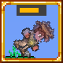

# Dodgeroll

  

A Terraria mod that seeks to add a highly configurable dodgeroll to serve all your i-frame dodging needs. This is probably unbalanced when playing with other mods / base Terraria content, so configure it to be as broken or as balanced as you want it to be (the base configuration is what I personally enjoy using).

This is my first mod for Terraria, so expect some bugs and unintended behaviors while using it. You're welcome to report those to me at the [Issues](https://github.com/JonasueDaze/Dodgeroll/issues) tab or at the Steam Workshop page (though it may take some time for me to get into them).

## Features

- Dodgerolls speed boosts are added to your current momentum, so you can do some movements like dodgerolling while grappling downwards to get some horizontal movement boost.
- Dodgerolls are 8-directional, so you can dodge upwards, downwards (in place), or even diagonally. Do note that because it's based on current momentum, for example, you get more speed boost out of dodging upwards while ascending than while descending.
- Adds a stamina mechanic so that you cannot just span dodgeroll infinitely, with some configurable options (like how much stamina it costs, how much it regenerates per second, its stamina regeneration cooldown, etc).
- Some configurable aspects to the dodgeroll, like how many frames it will last, the amount of speed gained or how many i-frames to have while dodging.

## Credits

This mod was influenced by [TerrariaOverhaul](https://github.com/Mirsario/TerrariaOverhaul) and [DodgeMod](https://github.com/Antinoe/DodgeMod), while trying to do my own takes on the dodgeroll implementation.